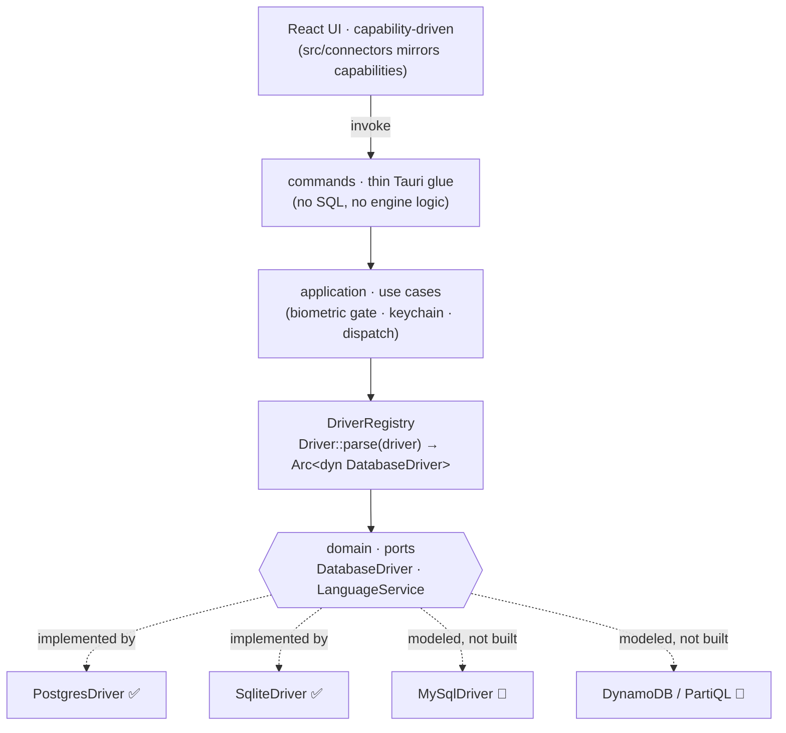

<div align="center">

# 🦀🦫 Crabeaver

### A fast, native, multi-engine database IDE — where every database is a plug-in.

Crabeaver is a desktop SQL workbench built on **Rust + Tauri**, not Electron. It pairs a
Monaco-powered editor with schema-aware completion and **per-dialect linting**, a rich
results grid, and a deep table inspector — behind an architecture where adding a new
database engine means *implementing a trait*, not rewriting the app.


</div>

<!-- TODO: drop a screenshot at docs/screenshot.png and uncomment:
<p align="center"></p>
-->

---

## Why Crabeaver

Most database tools are either heavy Electron apps or locked to one engine. Crabeaver bets
on a different shape:

- **Native & fast.** A Rust core (Tauri v2) with a React/TypeScript front end. No Chromium runtime tax.
- **Engines are plug-ins.** Postgres and SQLite ship today, behind a single `DatabaseDriver`
  trait. The whole app — UI, linting, completion, the inspector — adapts to **capabilities each
  connector declares**, so a connector never offers a button its engine would reject.
- **The editor actually understands your dialect.** Validation and autocomplete are
  dialect-parameterized: Postgres lints as Postgres, SQLite as SQLite, MySQL as MySQL.
- **Secrets stay put.** Passwords live in the OS keychain, never cross to the front end
  (enforced at compile time *and* by a test), and connections can be gated behind Touch ID.

## Features

**✍️ Editor** — Monaco with schema-aware completion (tables, columns, FKs), dialect-aware
inline validation, statement folding, a custom diagnostics gutter, run-statement-under-cursor,
and remembered scroll position per query.

**🗃️ Engines** — PostgreSQL and SQLite behind one `DatabaseDriver` trait + registry. MySQL and
DynamoDB/PartiQL are modeled in the type system as documented seams, ready to implement.

**🔎 Inspector** — schema → table tree, deep table details (columns, constraints, foreign keys,
indexes, reconstructed DDL), database switching, and Postgres **session** and **lock** managers
(shown only where the engine supports them).

**📊 Results** — a TanStack-powered grid with `LIMIT`/`OFFSET` pagination on scroll, sorting,
per-column filtering, foreign-key click-through navigation, and per-tab result caching.

**🔐 Security** — OS keychain password storage (macOS `security` / `keyring` elsewhere), Touch ID
connection gating, and identifier-injection-safe introspection. A dedicated **disaster-test**
suite pins the invariants that must never break.

**🎨 Polish** — query files saved to disk with a rolling `.history`, a themeable UI with a theme
marketplace, cancelable queries, and a tabbed, resizable workspace.

## Architecture — connectors are plug-ins

The codebase is hexagonal and the seams are *load-bearing*, not decorative. Engine code lives
only in the infrastructure layer; everything else speaks an engine-agnostic vocabulary and
dispatches on the connection's `driver` string.



**Layering rule:** `commands → application → domain ← infrastructure`. The `domain` layer
imports no engine crate; `infrastructure` is the only place `sqlx::postgres` / `sqlx::sqlite`
appear; a `#[tauri::command]` is ~3 lines that call one use case. Linting and completion follow
the same shape behind a `LanguageService` port.

### Add a database engine in 4 steps

1. Add a `Driver` variant and its `Capabilities` in `domain/capabilities.rs`.
2. Implement `DatabaseDriver` in `infrastructure/database/<engine>/`. A `false` capability flag
   *must* make that method return `Unsupported` — never panic.
3. Register it in `infrastructure/database/registry.rs`.
4. Mirror its capabilities in `src/connectors/<engine>.ts`.

You shouldn't need to touch `commands`, `application`, or the editor. The full checklist and the
rules that keep it that way live in **[`AGENTS.md`](./AGENTS.md)**, with a `README.md` in every
backend layer and in `src/connectors/`.

## Tech stack

| Layer | Tools |
|---|---|
| Shell | [Tauri v2](https://tauri.app) (Rust) |
| Backend | Rust 2024 · [`sqlx`](https://github.com/launchbadge/sqlx) (SQLite + Postgres) · [`sqlparser`](https://github.com/apache/datafusion-sqlparser-rs) · `security-framework` / `keyring` |
| Frontend | React 19 · TypeScript · [Vite](https://vitejs.dev) · [Monaco](https://microsoft.github.io/monaco-editor/) · [TanStack Table](https://tanstack.com/table) · [Tailwind](https://tailwindcss.com) |
| IPC | Tauri `invoke()` — typed commands between the front end and the Rust core |

## Getting started

**Prerequisites:** [Rust](https://rustup.rs) (stable), [Node.js](https://nodejs.org) 20+, and the
[Tauri v2 system dependencies](https://tauri.app/start/prerequisites/) for your OS.

```bash
git clone <this-repo> crabeaver && cd crabeaver
npm install
npm run tauri dev        # launch the app with hot-reload (frontend + Rust)
```

Other useful commands:

```bash
npm run build            # frontend type-check (tsc -b) + production bundle
npm run lint             # eslint
npm test                 # frontend unit tests (vitest)
cd src-tauri && cargo test    # Rust unit + integration + disaster tests
cd src-tauri && cargo clippy --all-targets -- -D warnings
```

> Type-check note: the root `tsconfig.json` is a solution file, so `tsc --noEmit` checks nothing —
> use `npm run build` for the real type check. (Documented in `AGENTS.md`.)

## Testing

Crabeaver is tested at both ends, and CI (`.github/workflows/ci.yml`) gates every push:

- **Rust (65 tests):** unit tests, SQLite **integration** tests against a real temp database
  (execute, introspection, table details, concurrency), and a **disaster** suite for things that
  must never happen — a password serializing to the front end, a `"; DROP TABLE` identifier
  executing, garbage driver strings panicking, NULL/blob/megabyte decode, or unbounded recursion.
- **Web (38 tests):** the connector registry & capability gating, dialect routing, the statement
  splitter under pathological input, tab state, and scroll persistence.

```
src-tauri/tests/sqlite_driver.rs   # second engine, end-to-end
src-tauri/tests/disaster.rs        # security + stability invariants
```

## Project layout

```
src/                       React front end
  components/               editor, results grid, inspector, sidebar, settings
  connectors/               per-engine descriptors (mirror of backend capabilities)
  context/ hooks/ lib/      tab state, validation, persistence helpers
  workers/                  off-thread SQL statement splitting
src-tauri/src/
  domain/                   pure types + ports (no engine crates)
  application/              use cases (orchestration)
  infrastructure/           drivers, language services, keychain, biometric
  commands/                 thin Tauri command adapters
AGENTS.md                  architecture rules + how-to-add-a-connector
```

## Roadmap

- [x] Pluggable `DatabaseDriver` + `DriverRegistry`
- [x] PostgreSQL and SQLite connectors
- [x] Dialect-pluggable linting & completion
- [x] Capability-driven UI, keychain + Touch ID, disaster tests
- [ ] MySQL connector (modeled — implement the trait)
- [ ] DynamoDB / PartiQL (non-SQL language service)
- [ ] Query history search, saved connections sync, CSV/JSON export

## The name

**Crab** 🦀 (Rust's mascot, Ferris) **+ beaver** 🦫 (nature's tireless engineer) =
**Crabeaver** — a Rust-native database workbench, inspired by the SQL tools that came before it,
built fresh from the ground up.

## License

Not yet licensed. Add a `LICENSE` file before publishing or accepting contributions.
